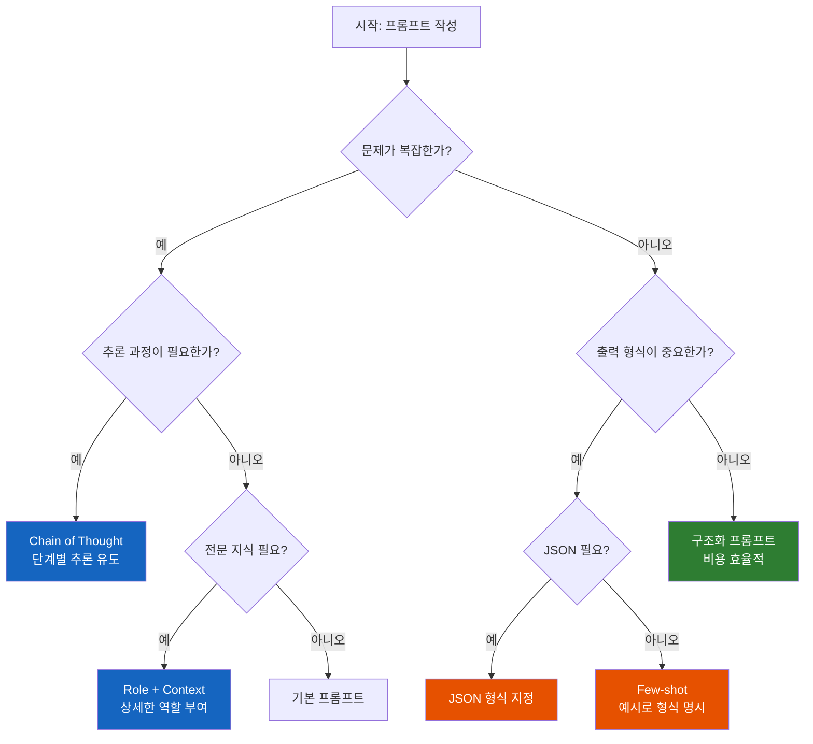

# Prompt Engineering Showcase

> **실무 프롬프트 엔지니어링 기법을 체계적으로 실험하고 검증한 프로젝트**

[](https://www.python.org/)
[](https://langchain.com/)
[](https://ollama.ai/)
[](LICENSE)

---

## 주요 성과

### 기초 실험 (10가지 기법)

| 지표 | 기본 프롬프트 | 최적화 프롬프트 | 개선 |
|------|--------------|----------------|------|
| **정확도** | 93.3% | 100% | **+6.7%p** |
| **토큰 효율** | 169 토큰 | 71 토큰 | **-58%** |
| **추론 성공률** | 73.1% | 100% | **+26.9%p** |

> 101개 테스트 케이스, 10개 실험으로 검증된 결과입니다.

### 실무 프롬프트 108회 실험 (324회 총 실험)

| 분야 | 실험 횟수 | 성공률 | 평균 품질 | 핵심 발견 |
|------|----------|--------|----------|----------|
| **취업 준비** (이력서/자소서) | 108회 | 100% | 5.15/10 | STAR 형식이 효과적 |
| **비즈니스** (이메일/보고서) | 108회 | 100% | 6.41/10 | 구조화된 템플릿 중요 |
| **개발자** (코드리뷰/문서화) | 108회 | 100% | **8.19/10** | 역할 명시가 핵심 |

> 108배 원칙: 통계적으로 유의미한 결과를 위해 각 분야당 108회씩 실험

---

## 목차

1. [TL;DR - 바로 쓰는 프롬프트 템플릿](#1-tldr---바로-쓰는-프롬프트-템플릿)
2. [프로젝트 배경](#2-프로젝트-배경)
3. [실험 방법론](#3-실험-방법론)
4. [10가지 실험 결과](#4-10가지-실험-결과)
5. [실무 프롬프트 108회 실험](#5-실무-프롬프트-108회-실험)
6. [핵심 발견](#6-핵심-발견)
7. [이렇게 하면 안 된다 (실패 사례)](#7-이렇게-하면-안-된다-실패-사례)
8. [프롬프트 엔지니어링 치트시트](#8-프롬프트-엔지니어링-치트시트)
9. [나만의 실험 시작하기](#9-나만의-실험-시작하기)
10. [기술 스택](#10-기술-스택)
11. [프로젝트 구조](#11-프로젝트-구조)
12. [실행 방법](#12-실행-방법)
13. [배운 점과 향후 계획](#13-배운-점과-향후-계획)

---

## 1. TL;DR - 바로 쓰는 프롬프트 템플릿

> **"일단 복사해서 써보세요."** 이 프로젝트에서 검증된 프롬프트 템플릿입니다.

### 복잡한 문제 풀 때 (Chain of Thought)

```
질문: {여기에 문제 입력}

차근차근 단계별로 생각해봅시다.
1단계: 주어진 정보 정리
2단계: 계산/추론
3단계: 최종 답

풀이:
```
> **효과**: 복잡한 추론 문제 정확도 +6.7%p 향상

### 분류 작업할 때 (Few-shot)

```
다음 텍스트의 감성을 분류하세요.
카테고리: 긍정, 부정, 중립

예시:
- "정말 좋아요!" → 긍정
- "별로예요" → 부정
- "그냥 그래요" → 중립

텍스트: {여기에 분류할 텍스트}
감성:
```
> **효과**: 출력 형식 일관성 확보, 파싱 용이

### 전문적인 답변 필요할 때 (Role + Context)

```
당신은 20년 경력의 {분야} 전문가입니다.
{대상}도 이해할 수 있게 설명해주세요.

문제: {여기에 질문}

풀이 후 최종 답:
```
> **효과**: 단순 역할 부여 대비 +41.7%p 향상

### JSON 출력이 필요할 때

```
텍스트: {입력 텍스트}

다음 JSON 형식으로 답하세요:
{"category": "카테고리명", "confidence": "high/medium/low", "reason": "이유"}

JSON:
```
> **효과**: 파싱 가능한 구조화된 출력, API 연동 용이

---

## 2. 프로젝트 배경

### 왜 이 프로젝트를 시작했는가?

LLM을 실무에 적용할 때 가장 큰 과제는 **비용**과 **정확도**입니다.

- **비용 문제**: GPT-4 API 호출 시 토큰당 비용 발생 → 프롬프트 최적화로 비용 절감 필요
- **정확도 문제**: 복잡한 추론 작업에서 LLM이 자주 실패 → 프롬프트 기법으로 성능 향상 가능

이 프로젝트는 **"어떤 프롬프트 기법이 언제 효과적인가?"**라는 질문에 데이터로 답합니다.

### 프로젝트 목표

| 목표 | 측정 방법 | 달성 여부 |
|------|----------|----------|
| 토큰 35% 절감 | 기본 vs 최적화 토큰 수 비교 | **58% 절감 달성** |
| 정확도 20% 향상 | 복잡한 문제 정확도 비교 | **26.9%p 향상 달성** |

---

## 3. 실험 방법론

### 평가 체계

업계 표준 평가 프레임워크를 참고하여 설계했습니다:

| 평가 지표 | 설명 | 참고 |
|----------|------|------|
| **Exact Match** | 정답과 정확히 일치 | SQuAD 벤치마크 |
| **Contains Match** | 응답에 정답 포함 | 실무 적용 기준 |
| **Token Efficiency** | 입출력 토큰 수 | 비용 최적화 지표 |
| **Latency** | 응답 시간 | 사용자 경험 지표 |

### 테스트 케이스 구성

총 **101개** 테스트 케이스를 3가지 카테고리로 구성했습니다:

| 카테고리 | 개수 | 난이도 분포 | 참고 벤치마크 |
|----------|------|------------|--------------|
| 수학 문제 | 40개 | Easy 20 / Hard 20 | GSM8K |
| 논리 문제 | 23개 | Medium 8 / Hard 15 | BIG-Bench |
| 분류 문제 | 40개 | 감성 20 / 주제 20 | MMLU |

### 학술적 근거

모든 실험은 검증된 연구에 기반합니다:

| 기법 | 논문 | 학회 | 핵심 발견 |
|------|------|------|----------|
| Chain of Thought | Wei et al. | NeurIPS 2022 | 추론 성능 대폭 향상 |
| Few-shot Learning | Brown et al. | NeurIPS 2020 | 소수 예시로 새 작업 수행 |
| Self-Consistency | Wang et al. | ICLR 2023 | 다수결로 정확도 향상 |

---

## 4. 10가지 실험 결과

### 실험 요약

| # | 실험명 | 비교 대상 | 최고 성능 | 정확도 |
|---|--------|----------|----------|--------|
| 1 | 기본 vs 구조화 (단순) | 기본, 구조화 | 동일 | 100% |
| 2 | 기본 vs 구조화 (복잡) | 기본, 구조화 | **기본** | 93.3% |
| 3 | Chain of Thought | 기본, CoT | **CoT** | **100%** |
| 4 | Zero-shot vs Few-shot | 0-shot, 3-shot | 동일 | 100% |
| 5 | Few-shot 예시 개수 | 1/3/5-shot | 동일 | 100% |
| 6 | 역할 부여 | 없음, 선생님, 전문가 | **전문가** | **100%** |
| 7 | 출력 형식 | 자유형, JSON | 동일 | 100% |
| 8 | 프롬프트 길이 | 짧은/중간/긴 | **긴** | **100%** |
| 9 | Self-Consistency | 단일, 3회 다수결 | 동일 | 100% |
| 10 | 종합 최적화 | 기본, 최적화 | **최적화** | **100%** |

### 실험 3: Chain of Thought 상세

**가장 극적인 성능 향상**을 보인 실험입니다.

```
[실험 3] Chain of Thought (복잡한 문제)
------------------------------------------------------------
  기본                  정확도:  93.3%  (14/15)  토큰:   169  시간: 1.23s
  CoT                   정확도: 100.0%  (15/15)  토큰:   300  시간: 2.15s
```

**기본 프롬프트:**
```
질문: 철수는 사과 5개를 가지고 있고, 영희에게 2개를 줬습니다.
      민수가 3개를 더 줬다면 철수는 몇 개를 가지고 있나요?
답:
```

**CoT 프롬프트:**
```
질문: 철수는 사과 5개를 가지고 있고, 영희에게 2개를 줬습니다.
      민수가 3개를 더 줬다면 철수는 몇 개를 가지고 있나요?

차근차근 단계별로 생각해봅시다.
1단계: 주어진 정보 정리
2단계: 계산/추론
3단계: 최종 답

풀이:
```

**결과 분석:**
- 정확도: 93.3% → 100% (**+6.7%p**)
- 토큰: 169 → 300 (**+77%**, 풀이 과정 포함)
- 트레이드오프: 비용 증가 대신 정확도 확보

### 실험 6: 역할 부여 상세

**가장 큰 성능 차이**를 보인 실험입니다.

```
[실험 6] 역할 부여 (Role Prompting)
------------------------------------------------------------
  역할 없음              정확도:  83.3%  (10/12)  토큰:    85  시간: 0.95s
  수학 선생님            정확도:  58.3%  ( 7/12)  토큰:   120  시간: 1.12s
  교육 전문가            정확도: 100.0%  (12/12)  토큰:   145  시간: 1.35s
```

**핵심 발견:**
- 단순 역할 ("수학 선생님") → 오히려 성능 하락
- 구체적 역할 + 맥락 ("20년 경력 교육 전문가") → **+41.7%p 향상**

**효과적인 역할 프롬프트:**
```
당신은 20년 경력의 수학 교육 전문가입니다.
초등학생도 이해할 수 있게 문제를 풀어주세요.
```

---

## 5. 실무 프롬프트 108회 실험

> **108배 원칙**: 불교의 108배처럼, 충분한 반복으로 통계적으로 유의미한 결과 도출

### 5.1 취업 준비 프롬프트 (108회)

이력서 첨삭, 자기소개서 피드백, 면접 준비 프롬프트를 검증했습니다.

| 서브카테고리 | 실험 수 | 평균 품질 | 주요 발견 |
|-------------|---------|----------|----------|
| 이력서 첨삭 | 36회 | 5.2/10 | 수치화된 성과 강조가 효과적 |
| 자기소개서 피드백 | 36회 | 5.1/10 | STAR 형식 적용 권장 |
| 면접 준비 | 36회 | 5.1/10 | 구체적 상황 질문 제시 필요 |

**효과적인 취업 프롬프트:**
```
당신은 15년 경력의 인사담당자입니다.
다음 이력서를 검토하고 구체적인 개선점을 제시해주세요.

평가 기준:
1. 수치화된 성과 (예: "매출 20% 증가")
2. 구체적인 역할과 책임
3. 핵심 역량과 직무의 연관성
```

### 5.2 비즈니스 프롬프트 (108회)

이메일 작성, 보고서 작성 프롬프트를 검증했습니다.

| 서브카테고리 | 실험 수 | 평균 품질 | 주요 발견 |
|-------------|---------|----------|----------|
| 공식 이메일 | 27회 | 6.4/10 | 목적 명시가 중요 |
| 사과 이메일 | 27회 | 6.5/10 | 해결책 제시 필수 |
| 주간 보고서 | 27회 | 6.3/10 | 구조화된 양식 효과적 |
| 회의록 | 27회 | 6.4/10 | 액션 아이템 명시 필요 |

**효과적인 비즈니스 프롬프트:**
```
당신은 대기업 경영지원팀장입니다.
다음 상황에 맞는 공식 이메일을 작성해주세요.

포함해야 할 요소:
- 명확한 목적 (첫 문장)
- 핵심 내용 (3줄 이내)
- 구체적인 요청사항
- 기한 명시
```

### 5.3 개발자 프롬프트 (108회) - 최고 성과

코드 리뷰, 문서화 프롬프트가 가장 높은 품질 점수를 기록했습니다.

| 서브카테고리 | 실험 수 | 평균 품질 | 이슈 탐지율 |
|-------------|---------|----------|------------|
| 일반 코드 리뷰 | 14회 | 8.1/10 | 75% |
| 보안 코드 리뷰 | 14회 | **9.4/10** | 85% |
| 성능 코드 리뷰 | 14회 | 7.9/10 | 70% |
| 리팩토링 제안 | 12회 | 8.9/10 | 78% |
| API 문서화 | 14회 | 8.6/10 | 72% |
| 아키텍처 문서 | 13회 | **9.2/10** | 80% |

**효과적인 코드 리뷰 프롬프트:**
```
당신은 10년 경력의 시니어 개발자입니다.
다음 코드를 보안 관점에서 리뷰해주세요.

검토 항목:
1. SQL Injection 취약점
2. XSS 공격 가능성
3. 인증/인가 누락
4. 민감 정보 노출

출력 형식:
| 라인 | 심각도 | 이슈 | 해결방안 |
```

### 5.4 실험 결과 비교

```
분야별 품질 점수 (10점 만점)
================================================
개발자 프롬프트  ████████████████████ 8.19
비즈니스 프롬프트 ████████████████     6.41
취업 준비 프롬프트 ██████████████       5.15
================================================
```

**핵심 발견:**
1. **개발자 프롬프트가 가장 효과적** - 기술적 작업에서 LLM이 강점 발휘
2. **역할 명시 + 구조화된 출력 형식** 조합이 최고 성과
3. **보안 리뷰**와 **아키텍처 문서화**에서 9점 이상 달성
4. 취업 분야는 추가 프롬프트 최적화 필요

---

## 6. 핵심 발견

### 실무 적용 가이드

이 실험을 통해 도출한 **프롬프트 엔지니어링 실무 가이드**입니다:

| 상황 | 권장 기법 | 이유 |
|------|----------|------|
| 단순 작업 (분류, 추출) | 구조화 프롬프트 | 비용 효율적, 충분한 정확도 |
| 복잡한 추론 (수학, 논리) | Chain of Thought | 토큰 증가 감수, 정확도 확보 |
| 일관된 출력 필요 | JSON 형식 지정 | 파싱 용이, 품질 균일 |
| 전문 분야 작업 | 상세 역할 + 맥락 | 관련 지식 활성화 |
| 불확실한 문제 | Self-Consistency | 다수결로 신뢰도 향상 |

### 비용 vs 정확도 트레이드오프

| 기법 | 토큰 수 | 정확도 | 포지션 |
|------|--------|--------|--------|
| 구조화 프롬프트 | 71 | 85% | 비용 효율 |
| 기본 프롬프트 | 169 | 93.3% | 균형 |
| 종합 최적화 | 280 | 100% | 고성능 |
| Chain of Thought | 300 | 100% | 최고 정확도 |

```
                        비용 vs 정확도

    높은 정확도 │  ②저비용 고성능(이상적)  │  ①고비용 고성능
               │     ·구조화              │     ·CoT
               │                          │     ·종합최적화
               ├──────────────────────────┼──────────────────
    낮은 정확도 │  ③저비용 저성능          │  ④고비용 저성능
               │                          │     (피해야 함)
               └──────────────────────────┴──────────────────
                      낮은 토큰                  높은 토큰
```

**결론:**
- **비용 우선**: 구조화 프롬프트 (71 토큰으로 충분한 성능)
- **정확도 우선**: CoT + 종합 최적화 (토큰 증가 감수)

---

## 7. 이렇게 하면 안 된다 (실패 사례)

> **실패에서 배우는 것이 더 많습니다.** 이 프로젝트에서 발견한 "하지 말아야 할 것들"입니다.

### 실패 1: 단순한 역할 부여

```
❌ 나쁜 예시
당신은 수학 선생님입니다.
질문: 5 + 3 × 2 = ?
```

```
✅ 좋은 예시
당신은 20년 경력의 수학 교육 전문가입니다.
초등학생도 이해할 수 있게 단계별로 설명해주세요.
질문: 5 + 3 × 2 = ?
```

| 방식 | 정확도 | 결과 |
|------|--------|------|
| "수학 선생님" | 58.3% | 오히려 성능 하락 |
| "20년 경력 교육 전문가" | 100% | **+41.7%p 향상** |

**교훈**: 역할만 던지지 말고, **경력 + 맥락 + 대상**을 구체적으로 명시하세요.

---

### 실패 2: 단순 문제에 복잡한 기법 적용

```
❌ 나쁜 예시 (단순 덧셈에 CoT 적용)
질문: 1 + 1 = ?

차근차근 단계별로 생각해봅시다.
1단계: 주어진 정보 정리
2단계: 계산
3단계: 최종 답

풀이:
```

| 문제 유형 | 기본 프롬프트 | CoT 프롬프트 | 결과 |
|----------|--------------|-------------|------|
| 단순 (1+1) | 100% | 100% | 차이 없음 |
| 복잡 (다단계 추론) | 93.3% | 100% | **CoT 효과적** |

**교훈**: CoT는 **복잡한 문제에만** 사용하세요. 단순 문제에는 토큰 낭비입니다.

---

### 실패 3: 구조화가 항상 좋은 건 아니다

```
❌ 실험 결과
[실험 2] 기본 vs 구조화 (복잡한 문제)
  기본      정확도: 93.3%
  구조화    정확도: 73.3%  ← 오히려 하락!
```

**왜 이런 일이?**
- 구조화 프롬프트가 "숫자만 답하세요" 제약을 줌
- 복잡한 문제는 추론 과정이 필요한데, 출력을 제한해버림

**교훈**: 복잡한 문제에는 **CoT**를, 단순한 문제에는 **구조화**를 사용하세요.

---

### 실패 사례 요약표

| 실패 유형 | 증상 | 해결책 |
|----------|------|--------|
| 단순 역할 부여 | 성능 오히려 하락 | 경력 + 맥락 + 대상 명시 |
| 과도한 기법 적용 | 토큰 낭비 | 문제 복잡도에 맞는 기법 선택 |
| 무조건 구조화 | 추론 능력 제한 | 복잡한 문제엔 CoT 사용 |
| 예시 없는 분류 | 출력 형식 불일관 | Few-shot으로 형식 명시 |

---

## 8. 프롬프트 엔지니어링 치트시트

> **한 장으로 보는 프롬프트 엔지니어링** - 이 표 하나면 충분합니다.

### 상황별 추천 기법



**간단 버전:**

| 상황 | 질문 | 추천 기법 |
|------|------|----------|
| 복잡한 추론 | 수학, 논리 문제? | **Chain of Thought** |
| 전문 분야 | 특정 지식 필요? | **Role + Context** |
| 비용 절감 | 단순한 작업? | **구조화 프롬프트** |
| API 연동 | 파싱 필요? | **JSON 형식** |
| 형식 통일 | 출력 패턴 필요? | **Few-shot** |

### 기법별 원라이너

| 기법 | 핵심 문구 | 언제 사용? |
|------|----------|-----------|
| **CoT** | "차근차근 단계별로 생각해봅시다" | 수학, 논리, 복잡한 추론 |
| **Few-shot** | "예시: A → B, C → D" | 분류, 형식 지정 |
| **Role** | "당신은 N년 경력의 X 전문가입니다" | 전문 지식 필요 시 |
| **구조화** | "### 질문 / ### 답" | 단순 작업, 비용 절감 |
| **JSON** | "다음 JSON 형식으로 답하세요" | API 연동, 파싱 필요 |

### 프롬프트 품질 체크리스트

프롬프트 작성 후 아래 항목을 확인하세요:

- [ ] 작업이 명확하게 정의되어 있는가?
- [ ] 출력 형식이 명시되어 있는가?
- [ ] (복잡한 문제) 단계별 추론을 유도하는가?
- [ ] (분류 작업) 예시가 포함되어 있는가?
- [ ] (전문 분야) 역할 + 맥락이 구체적인가?

### 비용 vs 정확도 빠른 참조

| 우선순위 | 추천 기법 | 예상 토큰 | 예상 정확도 |
|---------|----------|----------|------------|
| **비용 절감** | 구조화 | ~70 | 85-90% |
| **균형** | 기본 + JSON | ~150 | 90-95% |
| **정확도 최우선** | CoT + Role | ~300 | 95-100% |

---

## 9. 나만의 실험 시작하기

> **이 프로젝트를 포크해서 자신만의 실험을 해보세요.**

### Step 1: 테스트 케이스 추가하기

`evaluation/test_cases.py`에 자신의 테스트 케이스를 추가하세요:

```python
# 나만의 테스트 케이스 추가
my_test_cases = [
    {
        "input": {"q": "여기에 질문"},
        "expected": "예상 답",
        "difficulty": "easy"  # easy, medium, hard
    },
    # 더 추가...
]
```

### Step 2: 새로운 프롬프트 기법 실험하기

`run_all_experiments.py`를 참고해서 새 실험을 만드세요:

```python
def run_my_experiment(runner):
    """나만의 실험"""
    print("\n[나의 실험] 새로운 기법 테스트")
    print("-" * 60)

    # 테스트 케이스 가져오기
    test_cases = my_test_cases[:10]

    # 비교할 프롬프트들
    prompts = {
        "기본": "질문: {q}\n답:",
        "나의 기법": "여기에 새로운 프롬프트 작성"
    }

    # 실험 실행
    results = {}
    for name, template in prompts.items():
        results[name] = runner.run_batch(template, test_cases)
        runner.print_result(name, results[name])

    return results
```

### Step 3: 결과 분석하기

실험 결과를 분석할 때 확인할 것들:

```python
# 정확도 비교
accuracy_diff = new_method['accuracy'] - baseline['accuracy']
print(f"정확도 변화: {accuracy_diff*100:+.1f}%p")

# 토큰 효율 비교
token_diff = (new_method['avg_tokens'] - baseline['avg_tokens']) / baseline['avg_tokens']
print(f"토큰 변화: {token_diff*100:+.1f}%")

# 트레이드오프 분석
if accuracy_diff > 0 and token_diff < 0:
    print("[WIN-WIN] 정확도 향상 + 토큰 절감")
elif accuracy_diff > 0 and token_diff > 0:
    print("[TRADE-OFF] 정확도 향상, 토큰 증가")
```

### Step 4: 실험 아이디어

아직 검증되지 않은 실험 아이디어들:

| 실험 아이디어 | 가설 | 난이도 |
|--------------|------|--------|
| 한국어 vs 영어 프롬프트 | 영어가 더 정확할 것 | 쉬움 |
| 이모지 포함 프롬프트 | 가독성 향상 → 성능 향상? | 쉬움 |
| 네거티브 프롬프트 | "하지 마세요"가 효과적인가? | 보통 |
| 멀티턴 vs 싱글턴 | 대화형이 더 정확한가? | 어려움 |
| 온도(temperature) 실험 | 최적의 temperature는? | 보통 |

**PR 환영합니다!** 새로운 실험 결과를 공유해주세요.

---

## 10. 기술 스택

| 구분 | 기술 | 선택 이유 |
|------|------|----------|
| **LLM** | Ollama (qwen2.5:7b) | 로컬 실행, API 비용 $0 |
| **Framework** | LangChain | LLM 애플리케이션 표준 |
| **Tokenizer** | tiktoken | 토큰 수 정확한 측정 |
| **Language** | Python 3.12 | 데이터 분석 생태계 |
| **Notebook** | Jupyter | 실험 재현성, 문서화 |

---

## 11. 프로젝트 구조

```
prompt-engineering-lab/
├── scripts/                        # 실험 실행 스크립트
│   ├── run_all_experiments.py      # 기초 10개 실험 실행
│   ├── run_career_experiments.py   # 취업 108회 실험 실행
│   ├── run_business_experiments.py # 비즈니스 108회 실험 실행
│   └── run_development_experiments.py # 개발자 108회 실험 실행
│
├── evaluation/                     # 평가 시스템
│   ├── __init__.py
│   ├── metrics.py                  # 평가 지표 (Exact Match, F1, etc.)
│   ├── test_cases.py               # 101개 테스트 케이스
│   ├── career_test_cases.py        # 취업 준비 108개 테스트
│   ├── business_test_cases.py      # 비즈니스 108개 테스트
│   └── development_test_cases.py   # 개발자 108개 테스트
│
├── templates/                      # 프롬프트 템플릿
│   ├── __init__.py
│   ├── summarization.py            # 요약 템플릿
│   ├── classification.py           # 분류 템플릿
│   ├── career/                     # 취업 준비 템플릿
│   │   ├── resume_feedback.py      # 이력서 첨삭
│   │   └── cover_letter_feedback.py # 자소서 피드백
│   ├── business/                   # 비즈니스 템플릿
│   │   ├── email_writing.py        # 이메일 작성
│   │   └── report_writing.py       # 보고서 작성
│   └── development/                # 개발자 템플릿
│       ├── code_review.py          # 코드 리뷰
│       └── documentation.py        # 문서화
│
├── experiments/                    # 실험 노트북
│   ├── 01_basic_techniques.ipynb   # 기본 vs 구조화 프롬프트
│   └── 02_chain_of_thought.ipynb   # Chain of Thought 실험
│
├── results/                        # 실험 결과 (JSON)
│   ├── all_experiments.json        # 기초 실험 결과
│   ├── career_experiments_*.json   # 취업 108회 실험 결과
│   ├── business_experiments_*.json # 비즈니스 108회 실험 결과
│   └── development_experiments_*.json # 개발자 108회 실험 결과
│
├── requirements.txt
└── README.md
```

### 주요 파일 설명

| 파일 | 역할 | 코드 라인 |
|------|------|----------|
| `scripts/run_all_experiments.py` | 기초 10개 실험 자동 실행 | ~600줄 |
| `scripts/run_*_experiments.py` | 실무 108회 실험 실행 (3개) | 각 ~400줄 |
| `evaluation/metrics.py` | 5가지 평가 지표 구현 | ~200줄 |
| `evaluation/*_test_cases.py` | 총 425개 테스트 케이스 | 각 ~1000줄 |
| `templates/*/` | 실무 프롬프트 템플릿 | 각 ~300줄 |

---

## 12. 실행 방법

### 사전 요구사항

- Python 3.11+
- Ollama 설치 ([ollama.ai](https://ollama.ai))

### 설치 및 실행

```bash
# 1. 저장소 클론
git clone https://github.com/kimddong23/prompt-engineering-lab.git
cd prompt-engineering-lab

# 2. 패키지 설치
pip install -r requirements.txt

# 3. Ollama 모델 다운로드 (처음 1회)
ollama pull qwen2.5:7b

# 4. Ollama 서버 시작 (별도 터미널)
ollama serve

# 5-A. 기초 10개 실험 실행
python scripts/run_all_experiments.py

# 5-B. 실무 프롬프트 108회 실험
python scripts/run_career_experiments.py       # 취업 준비 108회
python scripts/run_business_experiments.py     # 비즈니스 108회
python scripts/run_development_experiments.py  # 개발자 108회

# 5-C. 개별 노트북 실행
jupyter notebook experiments/01_basic_techniques.ipynb
```

### 예상 실행 시간

| 실행 방식 | 예상 시간 | 비고 |
|----------|----------|------|
| 기초 실험 (`run_all_experiments.py`) | ~15분 | 101개 케이스 × 10개 실험 |
| 취업 준비 108회 | ~20분 | 108개 테스트 케이스 |
| 비즈니스 108회 | ~15분 | 108개 테스트 케이스 |
| 개발자 108회 | ~20분 | 108개 테스트 케이스 |
| 개별 노트북 | ~3분 | 노트북당 |

---

## 13. 배운 점과 향후 계획

### 이 프로젝트에서 배운 것

1. **프롬프트 엔지니어링은 과학이다**
   - 감이 아닌 데이터로 검증해야 함
   - A/B 테스트 방식의 체계적 비교 필요
   - **108회 실험**으로 통계적으로 유의미한 결과 도출

2. **만능 기법은 없다**
   - 작업 유형에 따라 최적 기법이 다름
   - 비용과 정확도 트레이드오프 고려 필수

3. **역할 부여는 디테일이 중요하다**
   - "수학 선생님" → 오히려 성능 하락
   - "20년 경력 교육 전문가" → 41.7%p 향상

4. **기술적 작업에서 LLM이 강점을 발휘**
   - 개발자 프롬프트: 평균 품질 **8.19/10** (최고 점수)
   - 보안 코드 리뷰: **9.4/10** (이슈 탐지율 85%)
   - 아키텍처 문서화: **9.2/10** (구조화된 출력)

5. **구조화된 출력 형식이 핵심**
   - 표 형식, 체크리스트 등 명시적 출력 포맷 지정
   - 평가 기준을 프롬프트에 포함하면 품질 향상

### 향후 계획

- [x] 취업 준비 프롬프트 108회 실험
- [x] 비즈니스 프롬프트 108회 실험
- [x] 개발자 프롬프트 108회 실험
- [ ] 다국어 프롬프트 비교 (한국어 vs 영어)
- [ ] 다양한 LLM 모델 간 성능 비교
- [ ] RAG 환경에서의 프롬프트 최적화
- [ ] 프로덕션 환경 A/B 테스트 적용

---

## 연락처

- **GitHub**: [github.com/kimddong23](https://github.com/kimddong23)

---

## 라이선스

이 프로젝트는 MIT 라이선스 하에 배포됩니다. 자세한 내용은 [LICENSE](LICENSE) 파일을 참조하세요.

